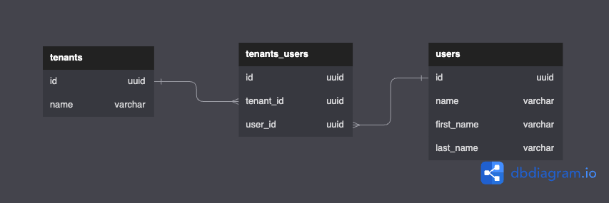

Volca is a SaaS boilerplate that has support for a project based multi-tenancy where users can start a subscription and collaborate with their teammates with minimal effort.



## Multitenancy

Multitenancy is a software architecture where a single instance of an application supports multiple tenants. A tenant is defined as a group of users that share a set of privileges in the application, such as performing operations on some resources in an API.

The opposite of multi-tenancy is single tenancy or multi-instance. With this pattern every user group would have its own instance of the application.

Here are some of the benefits of a multi-tenant application:

- **Cost** - One of the major benefits of multi tenant applications will be the cost. This is simply because multiple tenants share the same instance of the application. This is due to there being a baseline of cost when running servers or databases. Running 4 separate instances of smaller databases would cost more than running a larger instance that would serve all 4 tenants. It's comparable to having a set of people driving individual cars instead of bunching them up and driving them on a bus.
- **Releases** - When it comes to releases it is much more simple to release a new version of the service by deploying it to a single instance instead of multiple instances.
- **Data** - Having all the different tenant data in a single database makes it easier to manage the application by being able to run queries across the data of multiple tenants.

And some of the drawbacks:

- **Complexity** - There is additional complexity to running a multi tenant application since we need to implement functionality for isolating the different tenants from each other in the application.
- **Security** - Since the tenants data is hosted in the same database, we need to make sure that they cannot access each other. This would not be an issue if each tenant had a separate instance of the application.

## Deciding the database schema

One of the most important things with your multi tenancy setup will be how we design the database. In the diagram below I have created Many to Many relationship between users and tenants to allow a user to own multiple tenants but also be a part of other tenants.



## Setting up the project

Let's start setting up a multi tenant API with [Koa](https://koajs.com/) and [Knex](https://knexjs.org/)

```sh
$ npm init -y
```

```sh
$ npm install @koa/router koa koa-bodyparser typescript uuid
$ npm install --save-dev @types/koa @types/koa__router @types/koa-bodyparser @types/uuid
```

With dependencies installed, let's set up a server to host our routes.

```ts
import Koa, { Context, Next } from "koa";
import Router from "@koa/router";
import body from "koa-bodyparser";
import { v4 as uuid } from "uuid";

const app = new Koa();

const router = new Router();
router.use(body());

app.listen(3000, () => {
  console.log("Server listening on port 3000");
});
```

## Setting up a mock database

In the schema above we assume that a relational database is used, but in reality any database can be used, even though a relational database makes it easier to map the relationships between tenants and users.

In this article we will create a simple mock object to use instead of the database connection.

```ts
const db = {
  users: {
    create: ({
      id,
      first_name,
      last_name,
    }: {
      id: string;
      first_name: string;
      last_name: string;
    }) => {
      console.log("User created!");
    },
    find: (id: string) => ({
      id: "06acfb69-ce87-4aa6-a945-8047d4a05cd2",
      first_name: "John",
      last_name: "Doe",
    }),
  },
  tenants: {
    create: ({ id, name }: { id: string; name: string }) => {
      console.log("Tenant created!");
    },
    find: (id: string) => ({
      id: "7b190e2e-8071-4d45-8196-57f5c0baa4e7",
      name: "Volca",
    }),
  },
  tenantAdmins: {
    create: ({
      id,
      tenant_id,
      user_id,
    }: {
      id: string;
      tenant_id: string;
      user_id: string;
    }) => {
      console.log("Tenant admin created!");
    },
    find: (user_id: string, tenant_id: string) => ({
      id: "6758e69a-5f17-47eb-923e-e0a0ceef13e0",
      user_id: "06acfb69-ce87-4aa6-a945-8047d4a05cd2",
      tenant_id: "7b190e2e-8071-4d45-8196-57f5c0baa4e7",
    }),
  },
};
```

## Setting up the endpoints

With the server set up and the database schema created, we can now set up our first endpoint for creating tenants.

```ts
type CreateTenantRequest = {
  name: string;
  adminId: string;
};
router.post("/tenants", async ({ request, response }: Context) => {
  if (!request.body) {
    response.status = 401;
    return;
  }

  const { name, adminId } = <CreateTenantRequest>request.body;

  const tenantId = uuid();
  db.tenants.create({ id: tenantId, name });
  db.tenantAdmins.create({ id: uuid(), user_id: adminId, tenant_id: tenantId });

  response.status = 200;
});
```

Now that we are able to create new tenants, let's set up an endpoint for fetching resources for that specific tenant.

```ts
router.get("/:tenantId/resource", (ctx: Context) => {
  const { tenantId } = ctx.params;

  ctx.status = 200;
  ctx.body = {
    message: `This is a resource from the tenant with id ${tenantId}`,
  };
});
```

Since the route is scoped to a tenant, we can now fetch data from our database that is based on the tenants ID. However, this endpoint is open to anyone and any other tenant could fetch information from it. Let's fix that by adding a middleware to check that the user has access to the tenant.

This code snippet assumes that some mechanism for authentication has already been implemented to know what user is calling the service. Checkout [this article]("/authentication") for an introduction on how to create authentication with JSON web tokens.

```ts
const tenantRouter = new Router();
tenantRouter.use(body());

export const tenantAuthorizationMiddleware = async (
  ctx: Context,
  next: Next
) => {
  const tenantId = ctx.path.split("/")[1];
  const user = { id: "06acfb69-ce87-4aa6-a945-8047d4a05cd2" }; // make sure to implement a previous middleware to authenticate the user and attach it to the context

  const tenant = db.tenantAdmins.find(user.id, tenantId);

  if (!tenant) {
    ctx.status = 404;
    return;
  }

  next();
};
```

Now, if we add the resource endpoint to the tenant router, we will get a 404 response if we don't have access to that project. We are sending a 404 instead of a forbidden to not disclose information as to if the tenant exists or not.

## Next steps

Now we have a minimal setup for an application with support for multiple tenants. You can extend the functionality hidden behind the tenant middleware to add more specific functionality for the different tenants while keeping them separated.

We could also extend the functionality of the `tenant_users` table and introduce different roles that have access to perform specific actions in the application. For example an admin role that's allowed to perform any action and a read-only role that is only allowed to view information.
