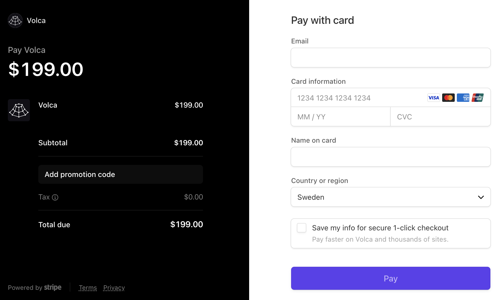
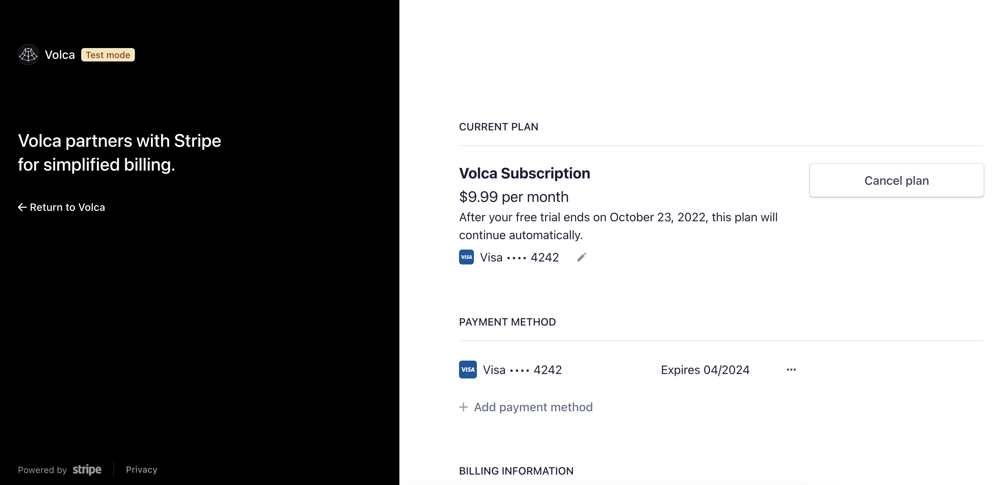
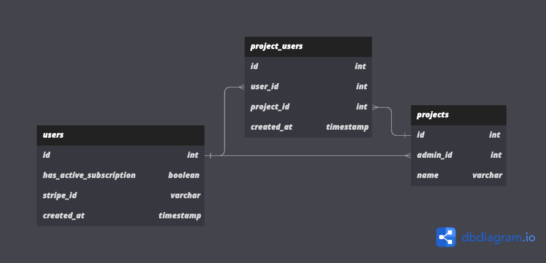

Volca is a SaaS boilerplate with support for subscription payments using Stripe out of the box. In this article, we go through how we implemented subscriptions and how you can do the same for your SaaS product.

## Why Stripe?

Building a SaaS product means you want something that works reliably fast. Stripe helps you implement a reliable payments systems way faster with automated tax collection, a sleek dashboard where you can manage customers, automated re-charging if the payment bounces and much more.

### Tax collection

SaaS products are in many cases available for a global customer base from day one. Depending on where in the world your customer is located, there might be different taxes that needs to be included in the purchase. Stripe helps you collect taxes and apply them on top of your price so that you don't have to think about it.

### Dashboard

The Stripe dashboard is helpful for a SaaS founder in many ways. It offers visualizations of the number of customers you have, how much your revenue is growing and also acts as an interface where you can help your customers with refunds, cancelling or updating their subscriptions.

### Automated re-charging

If a customer has signed up and for some reason their payment is declined, Stripe will automatically re-charge the customer until the payment goes through. This can help in cases where customers have outdated payment information and save them from churning.

### Stripe Checkout

Checkout is Stripes hosted UI for collecting payments from your SaaS app. Instead of building your own UI, you can simply redirect the user to Checkout instead and save many hours of development time. While it might not be possible to get the exact same look and feel as a custom solution, this is a great way to cut your time to market.

### Stripe Billing Portal

Billing Portal is a hosted UI for your users to manage their subscriptions. Just as with Checkout, this can save you lot of development time and give your users full control over their subscriptions. Using Billing Portal, your users will be redirected to the Stripe interface where they can cancel their subscription, manage their payment methods and see their billing history.

## Building subscription management for SaaS products

Let's get down to how the Volca SaaS boilerplate uses Stripe with Node.js / TypeScript to collect payments from users.

### Data model

Becoming a Volca subscriber means you get access to creating a `project`. You can then invite other users to access this project and collaborate on managing the entities that are connected to the `project`. The initial creator of a project becomes the `admin user` and is the user that pays for the project. If a project does not have an admin user with an active subscription, it will not be accessible.

Here is how we model this in our database:

### API

Our app interacts with Stripe through the Stripe API. In turn, Stripe uses webhooks that request our API to make relevant updates in our app.

Here is a diagram of the purchase flow:

Volca->Volca: User starts subscription flow
Volca->Stripe: Create Checkout session
Stripe->Volca: Checkout URL
Volca->Volca: User is redirected to Stripe Checkout
Stripe->Volca: Subscription created
Volca->Volca: Set stripe_id to the stripe customer ID for the user
Volca->Volca: Set has_active_subscription to true for the user
alt Subscription cancelled or payment fails
Volca->Volca: Set has_active_subcription to false for the user
end

- Code

## Things to consider

While the above fits many use cases, there might be more to think about when designing the payments system for your product.

### Free Tier

TODO:
In some cases, you might want to let your users try your product for free before you charge them money. If this is the case, you need to make sure to make sure the user can only access your free features in the frontend and the backend. You also need to make it clear what benefits the user gets by paying.

### Free Trial

TODO:
Volca comes with a free trial. This is easy to set up in Stripe.

### Usage Based Pricing

If the usage of your product has a linear relationship with your infrastructure costs, usage based pricing might be a good idea. One example could be an API product that causes your infra to cost more each time someone requests the API.

###

- Free tier
- Free trial
- Usage based pricing
- Customer support
